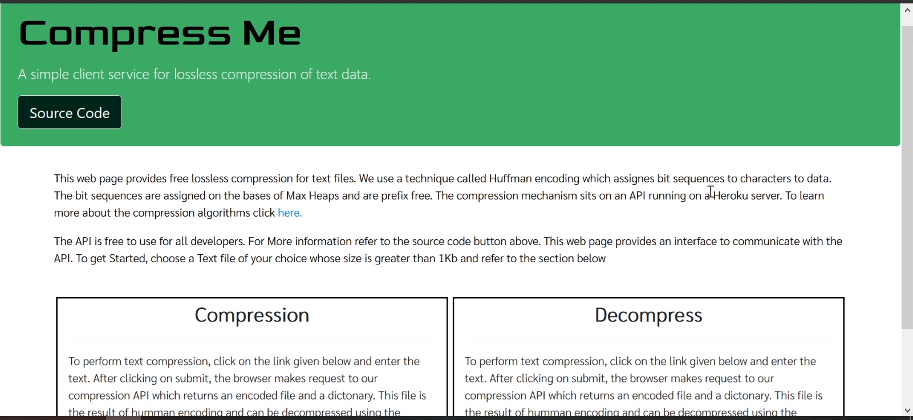

# Compress Me

### A small web application for losseless text compression

For A short Video Guid click <a href="https://www.youtube.com/watch?v=ouT8fTqci90">here</a>

## About

In 1952, David A. Huffman published a paper called "A Method for the Construction of Minimum-Redundancy Codes". In this He deviced a method for finding or using optimal prefix code that can be used in data compression.
The output from Huffman's algorithm can be viewed as a variable-length code table for encoding a source symbol (such as a character in a file).
 
The algorithm derives this table from the estimated probability or frequency of occurrence (weight) for each possible value of the source symbol. The optimality of this compression algorithm is in direct relation with the size of the subject.

In my observations, the said algorithm performed better when the size of the text document(which were my subject for testing) was greater than atleast 30Kb. The compression algorithm associates a dictonary to decompress the files that can take some storage as well.

 

This web application uses the Huffman compression techniques to compress text documents.

## Set up

- Node Js
- Typescript Compiler
- Express
- Browser (preferably chrome, firefox)

## Run

Start by openeing the terminal and run the following command

`npm install`

After the required modules are installed, you can run the application on the local server

`npm run dev`

Open the browser on **http://localhost:5000**

## Usage

- Open the web page at localhost:5000
- Click on Compress button at the bottom
- Select the **txt** file that you want to compress
- Click on Submit.

  - This will prompt a compression status and provide you
    with the link to download your compressed file
  - Please note that once compressed, the file is not readable
    by your text editor since it is a **binary file**.
  - There is another link which downloads a dictionary JSON file.
    This will be crucial when you want to decompress this binary file.

- To Decompress the binary file, click on Decompress button and upload your binary file along with the Json dict and submit
